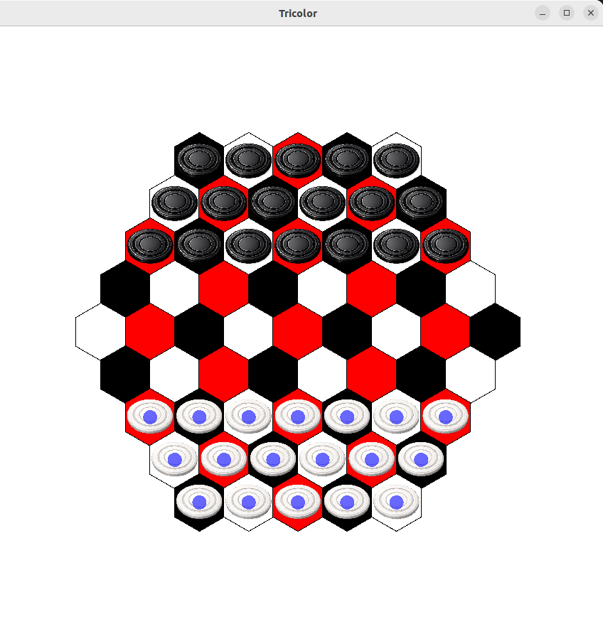

# This is the C++ implementation of the Tricolor framework

## Setup

### Linux

First, install essentials (if not already done) to have `g++` and `make`:
<pre>
sudo apt update 
sudo apt install build-essential
</pre>

Then, install the SFML library for 2D graphics:
<pre>
sudo apt install libsfml-dev
</pre>

## How to run

### Game metrics

The following command builds the executable that runs the simulations and then computes the metrics:

<pre>
make game_behaviour_metrics
</pre>
then, to run it:
<pre>
./game_behaviour_metrics "agent1" "agent2" "games_to_simulate"
</pre>

### Playing the game

The following command builds the executable that runs a game of Tricolor between 2 players:
<pre>
make tricolor_game_opti
</pre>
then, to run it:
<pre>
./tricolor_game_opti "agent1" "agent2"
</pre>
like for example
<pre>
./tricolor_game human random
</pre>

Then, a window will pop up and the game starts immediatly.

## How to play the game

### Rules

The rules can be red in the `Boutin - Tricolor, 2021.pdf` file in the `others/books/` directory found at the root.

### Board and Pieces interaction

As a human, you will see your `available` moves by the `blue circles` on the corresponding hex tiles. This means you can only move pieces and stacks on those given hex tiles.

To select different number of pieces from a stack, use `left-click` to `remove` one piece and `right-click` to `add` one. The number of pieces you `selected` is colored in `green`. By default, the first time when you click on a stack, all the pieces will be selected. If you wish to unselect a stack, click outside the board or on a hex tile where you can't move.

### Additional "50-moves rule"

If no `capture` happened in the last `100` moves (`50` moves by each player), then the game ends in a `draw`.